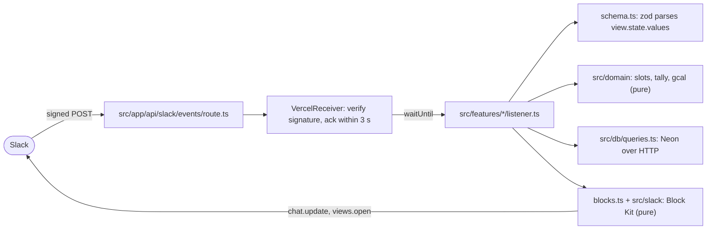

# Architecture

Meeting Mouse is a Slack app: an availability poll that lives in one channel message and
updates in place. The web app at meetingmouse.net is a static homepage, a route handler that
receives every Slack request, and one optional page outside Slack, the
[web grid](./WEB_GRID.md), where a person paints their availability by dragging.

## Request path



Arrows into `src/domain` and the block builders only ever carry data; ESLint rejects an import
of the database, Bolt or env from either. The rules are in [Dependency rules](#dependency-rules).

## Stack

| Concern       | Choice                                                                                                   |
| ------------- | -------------------------------------------------------------------------------------------------------- |
| Framework     | Next.js 16 App Router, TypeScript strict                                                                 |
| Slack         | `@slack/bolt` 5 + `@vercel/slack-bolt` (`VercelReceiver`, `createHandler`)                               |
| Hosting       | Vercel, Fluid Compute, Node.js runtime (never Edge)                                                      |
| Database      | Neon Postgres via `@neondatabase/serverless` (HTTP driver) + `drizzle-orm`; `drizzle-kit` SQL migrations |
| Validation    | `zod` for `view.state.values` and env                                                                    |
| Dates         | `date-fns` + `date-fns-tz`. Every instant is stored as UTC.                                              |
| Tests         | `vitest`                                                                                                 |
| Lint / format | `eslint` (boundaries below) + `prettier` (sorted imports, sorted Tailwind classes)                       |

## Request lifecycle

1. Slack POSTs to `/api/slack/events` (commands, interactivity, events all share the URL).
2. `src/app/api/slack/events/route.ts` asserts env, then hands the request to Bolt via `createHandler`.
3. `VercelReceiver` verifies the signature, **acks within 3 s**, and runs the rest of the listener under `waitUntil`.
4. The feature listener (`src/features/*/listener.ts`) fetches from `src/db/queries.ts`, calls pure `src/domain` functions, builds blocks with its `blocks.ts`, and calls the Slack Web API.

Consequence: anything after `ack()` is background work. It must be idempotent and must
surface errors to the user ephemerally (see [Testing](./TESTING.md#error-surfacing)).

## Embedding in another app

`createMeetingMouse({ features, signingSecret, auth, logLevel })` in `src/bolt/create.ts` builds
the Bolt app and the Vercel receiver from a list of features and nothing else. It never reads
the environment. The reference app in this repo calls it from `getBolt()` with `coreFeatures`
and the three env vars; a host that embeds Meeting Mouse calls it with `coreFeatures` plus its own
features and its own credentials. For one workspace, `auth: { token }`. For a deployment that
serves many, `auth: { authorize }`: Bolt calls it once per incoming request with the request's
`{ teamId, enterpriseId, userId, conversationId, isEnterpriseInstall }` and expects
`{ botToken, botId, botUserId }` back. For Slack OAuth, `auth: { oauth }` with the client id and
secret, a state secret, the scopes (`CORE_BOT_SCOPES` plus the host's own) and an installation
store: the receiver then serves the install path (`receiver.handleInstall`) and the callback
(`receiver.handleCallback`), and tokens come from the store per workspace. Self-hosting stays a
three-variable setup because the reference app uses the token form. Feature names must be
unique, and the factory throws on a duplicate. The host
owns its route handler, its env preflight and its migrations. The core's database client asks the
environment for `DATABASE_URL` and nothing else, so a host with no bot token in its environment
works.

The library build (`pnpm build:lib`, tsdown) ships five entry points:

| Import                | Holds                                                                 |
| --------------------- | --------------------------------------------------------------------- |
| `meetingmouse`        | `createMeetingMouse`, `coreFeatures`, the `Feature` and option types  |
| `meetingmouse/db`     | `CORE_MIGRATIONS`, the Drizzle `schema`, the queries, the lazy client |
| `meetingmouse/slack`  | Surface ids, Slack limits, formatting helpers                         |
| `meetingmouse/domain` | Slots, tally, calendar links, constants, types (pure)                 |
| `meetingmouse/web`    | `createGridHandlers`, `deriveGridSecret`, the grid link helpers       |

The tarball holds `dist/`, `drizzle/`, the README and the license, checked by
`scripts/check-pack.ts`. `pnpm smoke:pack` installs the tarball into a scratch project, imports
every entry point under the `react-server` condition a Next.js route handler runs under, and
proves the handler answers an unsigned request with 401. Every version tag attaches the tarball
to its GitHub release; publishing to npm is a separate switch (`.github/workflows/release.yml`).
Modules that import `server-only` (`createMeetingMouse`, the db client) need a host that honors the
`react-server` condition, which a Next.js route handler does.

## Directory layout

```
src/
  app/                      Next.js routes: homepage + api/slack/events/route.ts + grid/[token]/route.ts
                            + blog/ (index, post page, feed) + sitemap.ts
  blog/                     The blog: post schema, loader, Markdown renderer, feed, content check.
  components/brand.tsx      Logo, mark and mascot for the homepage and the icon
  components/site.tsx       The header and footer every page shares
  bolt/create.ts            createMeetingMouse(features, credentials): App + receiver for any host. server-only.
  bolt/app.ts               Reference wiring: env in, coreFeatures, built on first request. server-only.
  features/                 One directory per Slack surface, colocated:
    poll-create/            listener.ts · blocks.ts · schema.ts · *.test.ts
    poll-respond/
    poll-organize/
    app-home/
    index.ts                coreFeatures, the list a host passes to createMeetingMouse
    types.ts                Feature: a name and a register(app) function
  domain/                   Pure logic: constants, types, slots, tally, gcal. No I/O.
  slack/                    Shared Slack knowledge: limits.ts, format.ts, block helpers.
  web/                      The web grid: signed links, page state, the HTML page, its handlers.
  db/                       schema.ts (Drizzle), client.ts (server-only), queries.ts
  lib/                      env.ts (preflight), users.ts (users.info cache), log.ts,
                            refresh.ts (re-render the poll message from fresh reads),
                            respond.ts (response_url replies, Slack error codes),
                            site.ts (site URL, name, call-to-action links)
content/blog/               Blog posts, one Markdown file each. See docs/BLOG.md.
drizzle/                    Numbered SQL migrations generated from schema.ts
scripts/                    doctor, slack-sign, render-fixture, smoke-imports, check-docs,
                            check-feature-map, check-prose, check-blog, check-dev-env, dev.tunnel
tests/                      Cross-cutting tests + proof-of-failure fixtures
docs/                       These living documents
```

**Why by feature, not by type.** Someone fixing "the respond modal shows the wrong day"
opens one directory and finds the listener, the block builder, the payload schema and the
tests together. Grouping by type (`listeners/*.ts`, `blocks/*.ts`) spreads that one change
across four directories.

## Dependency rules

Enforced by `no-restricted-imports` in `eslint.config.mjs`; a violation fails `pnpm lint` and CI.

| From                             | May not import                                                         | Why                                                     |
| -------------------------------- | ---------------------------------------------------------------------- | ------------------------------------------------------- |
| `src/domain/**`                  | `@slack/*`, `next`, `@/db`, `@/bolt`, `@/slack`, `@/features`, `@/lib` | Pure functions: dates in, data out. Trivially testable. |
| `src/slack/**`                   | `@/db`, `@/bolt`, `@/features`                                         | Renders what it is handed; never fetches.               |
| `src/features/**/blocks*.ts`     | `@/db`, `@/bolt`                                                       | Same: block builders are renderers.                     |
| `src/app/**/*.tsx`, `components` | `@/db`, `@/bolt`, `@/lib/env`                                          | UI never reaches credentials.                           |

`src/db/client.ts` and `src/bolt/app.ts` start with `import "server-only"`, so an accidental
client import is a build error, not a review comment.

## Time zones

- Every slot is a UTC instant (`timestamptz`). Slot identity is its epoch seconds.
- **Channel message:** times use Slack's `<!date^{epoch}^{format}|{fallback}>` token, so each viewer sees their own local time. See `src/slack/format.ts`.
- **Respond modal:** option labels cannot use date tokens reliably, so labels are built server-side in the responder's zone (from `users.info` → `user.tz`, cached in `slack_users`). Slots are grouped by the responder's _local_ date; a slot can land on a different calendar day than the organizer's.
- DST: `generateSlots` skips nonexistent local times and de-duplicates repeated ones.

## Slack limits that shape the design

Constants in `src/slack/limits.ts`; poll limits in `src/domain/constants.ts`; the derivation is
asserted in `src/slack/limits.test.ts`.

| Limit                    | Value                                    | Consequence                                              |
| ------------------------ | ---------------------------------------- | -------------------------------------------------------- |
| Elements / actions block | 25                                       | A day's slots are one row of buttons; 24 slots fit       |
| Blocks / modal           | 100                                      | Polls capped at 14 days × 24 slots                       |
| Blocks / message         | 50                                       | Heatmap is one table block, not one block per slot       |
| Table block              | 100 rows, 20 cells per row, 10,000 chars | 14 days of 24 slots is 25 rows by 15 columns             |
| Section text             | 3000                                     | Only the best-times and everyone-free lines are sections |
| `trigger_id` lifetime    | ~3 s                                     | `views.open` a loading view first, DB work after         |

## Tradeoffs a reviewer will ask about

**Every click in the respond form is its own save.** The form is a row of buttons per day, one
per slot, and has no Save button. A click is acked, then `toggleSlot` flips that one slot in one
statement, the view is redrawn from what the database now holds, and the channel message is
re-rendered. The rejected alternative kept the choices in the view and wrote them on a Save: it
needs the same round trip per click to redraw the buttons, and loses everything if the person
closes the window. The cost is one write and one `chat.update` per click. Two clicks that race
both land in the database; the view can briefly show the earlier of the two, and the next click
or reopening the form corrects it.

**Two people answer within the same second.** Each write is one statement for one user. `refreshPollMessage` reads the aggregates after that write committed, so every render is
complete; two renders can still race on `chat.update`, and the last writer wins, which shows a
complete picture that may be one response newer than the other. Ordering is not guaranteed and
has not needed to be. The original plan reserved `pg_advisory_xact_lock(hashtext(poll_id))` for
the day flicker is observed; see [Data model](./DATA_MODEL.md).

**Why Next.js for one webhook and a page.** `@vercel/slack-bolt` ships `VercelReceiver` and
`createHandler` for a Next.js route handler and relies on `waitUntil` for the work after the ack.
The homepage and the webhook deploy as one project with one set of env vars, and `next typegen`
types the route. A bare function would drop the page and the typegen to save one framework.

**Where the in-Slack design stops.** The 100-block modal and 25 buttons per row cap a poll at 14 days of 24 slots and
the heatmap table holds at most 20 columns and squares, not shades, for intensity; see
[Slack limits that shape the design](#slack-limits-that-shape-the-design). Past that, the exits
are the [web grid](./WEB_GRID.md), which is built, and a rendered heatmap image, which is an
issue rather than built ahead of need.
