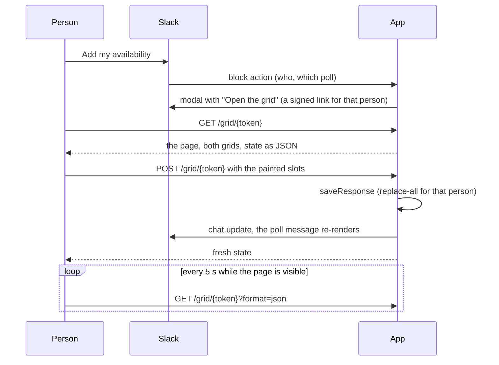

# Web grid

The web grid is one page outside Slack: a person paints their own availability on the left by
clicking and dragging, and the group's availability redraws on the right, darker green where
more people are free. It is optional. A host turns it on by giving `createMeetingMouse` a
`grid` option and mounting one route.

Slack cannot draw this. A modal has checkboxes and no paintable cells, a message is one column,
and the only way to color a table cell is an emoji. The poll message keeps its own grid of
squares as the summary in the channel; this page is where the input happens.

## Flow



## What stays in Slack

- Creating a poll, picking the final time, closing and deleting.
- The poll message, which is still where the group sees the result.
- The checkbox form. The modal offers **Use checkboxes instead**, and a host with no `grid`
  option goes straight to it, so the three-variable self-hosted setup is unchanged.

## The link is the credential

There is no sign-in and no cookie. `signGridLink` in `src/web/link.ts` packs the poll, the
workspace and the person with an expiry and signs them with HMAC-SHA256. Whoever holds the link
can read that poll and set that one person's availability on it, for 30 days. A fresh link is
one click away, so an expired one costs nothing.

- Slack tells the app who clicked, so the link is only ever shown to its owner, inside a modal.
- With no cookie there is nothing for another site to ride on, so the POST needs no CSRF token.
- The page is served `no-store`, `noindex`, `no-referrer`, with a content security policy that
  allows only its own inline style and script and requests to its own origin.
- The claims' workspace must match the poll's, so a link cannot be replayed against another
  workspace's poll.
- The key is separate from the Slack signing secret: `deriveGridSecret` derives it from a
  secret the host already holds, under a fixed label.

The rejected alternative was Sign in with Slack. It needs an OAuth client, a redirect URL and a
session store, which a three-variable self-hosted app does not have, and it protects nothing
more here: the worst a leaked link allows is editing one person's answer on one poll.

## Parts

| File                            | Holds                                                                            |
| ------------------------------- | -------------------------------------------------------------------------------- |
| `src/domain/grid.ts`            | `gridModel`: slots laid out as days by times of day. Shared with the Slack table |
| `src/web/link.ts`               | Sign, verify and build links. Pure, no I/O                                       |
| `src/web/state.ts`              | `gridState`: what one viewer's page draws, as JSON. Pure                         |
| `src/web/page.ts`               | The HTML document: both grids rendered on the server                             |
| `src/web/client.ts`             | The inline browser script: paint, redraw, save, poll                             |
| `src/web/handlers.ts`           | `createGridHandlers`: `GET` and `POST` for a host's route                        |
| `src/app/grid/[token]/route.ts` | The reference app's mount                                                        |
| `src/features/poll-respond/`    | The modal that leads with the link                                               |
| `scripts/grid-preview.ts`       | The page on a fixture poll with no Slack and no secrets                          |

The page is an HTML string from a route handler, not a React page. A host installs the library
and mounts two exported functions; it does not have to compile the library's components or
scan it for Tailwind classes.

## Mounting it in a host

```ts
// where the host builds the app
createMeetingMouse({
  features,
  signingSecret,
  auth,
  grid: { baseUrl: "https://app.example.com", secret: deriveGridSecret(someSecret) },
});

// src/app/grid/[token]/route.ts
const handlers = createGridHandlers({
  secret: deriveGridSecret(someSecret),
  clientFor: async (teamId) => new WebClient(await botTokenFor(teamId)),
});
export const GET = handlers.GET;
export const POST = handlers.POST;
```

The reference app turns the grid on when it knows its own origin: `APP_BASE_URL`, or on Vercel
the project's production domain. See [Local development](./LOCAL_DEV.md#environment-variables).

## Time zones

The page labels and groups by the viewer's Slack time zone, the same zone the checkbox form
uses, read from the `slack_users` cache. Opening the modal warms that cache. The page names the
zone under the title. There is no zone picker.

## Saving and live update

- A drag paints a rectangle from where it started, on or off according to the first cell.
- The group's side redraws from local state on every pointer move, before any request.
- 250 ms after the pointer lifts, the page posts every slot the person has selected. The write
  is the same replace-all statement the modal uses, so the two can never disagree about shape.
- While a save is in flight further changes wait, then go out as one more save.
- A failed save says so and retries every 3 s.
- Every 5 s a visible, idle page fetches the state again, which is how other people's answers
  and a closed poll arrive.
- If the Slack message cannot be updated, the save still stands and the next render shows it.

## Verifying

- `pnpm test src/web src/domain/grid.test.ts` covers links, state and the handlers against an
  in-process Postgres.
- `pnpm grid:preview` serves a fixture poll on `http://localhost:4010` and prints one link per
  fixture person. Open two of them side by side. Drag on the left grid, watch "Saved" appear
  and the right grid darken, and watch the other window follow within 5 s.
- The browser script has no unit tests. It was checked by driving headless Chrome against the
  preview: a 5 by 2 drag selects 10 cells, a drag starting on a selected cell erases, Space
  toggles a focused cell, a reload keeps the answer, and a 390 px wide window does not scroll
  sideways.

## Limits and what is not built

- No zone picker, and no "who has not answered" list.
- The link is a bearer credential. It is not tied to a browser.
- Polling, not push: another person's change shows up within 5 s.
- A person who opens the grid and then saves a stale checkbox form overwrites what they painted.
  The modal says the grid saves as it goes.
