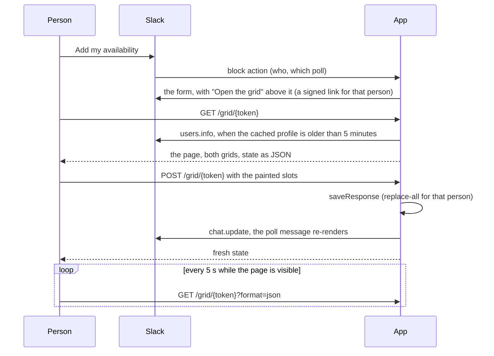

# Web grid

The web grid is one page outside Slack: a person paints their own availability on the left by
clicking and dragging, and the group's availability redraws on the right, darker green where
more people are free. It is optional. A host turns it on by giving `createMeetingMouse` a
`grid` option and mounting one route.

Slack cannot draw this. A modal has buttons and no paintable cells, a message is one column,
and the only way to color a table cell is an emoji. The poll message keeps its own grid of
squares as the summary in the channel; this page is where the input happens.

## Flow



## What stays in Slack

- Creating a poll, picking the final time, closing and deleting.
- The poll message, which is still where the group sees the result.
- The form of time buttons. It is what Add my availability opens, and nobody has to leave Slack to
  answer. The grid is a link above the form for people who would rather drag. A host with no
  `grid` option shows the form without the link, so the three-variable self-hosted setup is
  unchanged.

## The link is the credential

There is no sign-in and no cookie. `signGridLink` in `src/web/link.ts` packs the poll, the
workspace and the person with an expiry and signs them with HMAC-SHA256. Whoever holds the link
can read that poll and set that one person's availability on it, for 24 hours. A fresh link is
one click away, so an expired one costs little.

- Slack tells the app who clicked, so the link is only ever shown to its owner, inside a modal.
- With no cookie there is nothing for another site to ride on, so the POST needs no CSRF token.
- The page is served `no-store`, `noindex`, `no-referrer`, with a content security policy that
  allows only its own inline style and script and requests to its own origin.
- The claims' workspace must match the poll's, so a link cannot be replayed against another
  workspace's poll.
- The key is separate from the Slack signing secret: `deriveGridSecret` derives it from a
  secret the host already holds, under a fixed label.

The rejected alternative was Sign in with Slack. It needs an OAuth client, a redirect URL and a
session store, which a three-variable self-hosted app does not have, and it protects nothing
more here: the worst a leaked link allows is editing one person's answer on one poll.

## When access in Slack is lost

Slack's Marketplace guidelines say a web page should show a person only what they can already
see in Slack. The link is checked three ways on every `GET` and `POST`:

| Check                      | How                                                      | Refusal                                  |
| -------------------------- | -------------------------------------------------------- | ---------------------------------------- |
| Signature and expiry       | `verifyGridLink`; a link lives 24 hours                  | 404, "This link has expired"             |
| The person is still active | `users.info`, refused when Slack answers `deleted: true` | 403, "This link no longer works"         |
| Slack answered the check   | any failure of `clientFor` or `users.info`               | 503, "Slack could not confirm this link" |

- **24 hours, not 30 days.** Add my availability hands out a fresh link on every click, so a
  short life costs the person one click and bounds how long a link outlives their access.
- **Deactivation uses the scope the app already has.** `users:read` covers `users.info`. The
  answer is cached in `slack_users`, and the grid trusts a cached profile for 5 minutes
  (`GRID_PROFILE_MAX_AGE_MS`), not the 7 days the modals do. Asking on every request would
  put one `users.info` call behind each 5 s poll of each open page and spend the method's rate
  limit; never refreshing would hide a deactivation for a week. So a deactivated person is
  refused at most 5 minutes after Slack knows. A deactivated person is never cached.
- **It fails closed.** When Slack cannot be asked (rate limit, outage, a workspace whose token
  is gone) and no profile newer than 5 minutes is cached, the page shows nothing about the poll
  and says to try again or reopen the link from Slack. A save from an open page reports "Not
  saved" and retries every 3 s, so it goes through once Slack answers. The cost is that a
  Slack outage takes the page down with it; the alternative was showing a poll to someone the
  app could not vouch for.
- **An open page ends too.** On a 403 or 404 the browser script reloads, so the person sees the
  refusal instead of a grid that silently stopped saving.

**Rejected: checking channel membership.** `conversations.members` needs `channels:read` and
`groups:read`. The app's bot scopes are `commands`, `chat:write`, `chat:write.public` and
`users:read`. Two more scopes for one page fails least privilege, each has to be justified in
Marketplace review, and adding a scope makes every installed workspace install again.

**The gap that remains.** A person removed from the poll's channel, public or private, who
still has an account in the workspace and already holds a link can read that one poll and
change their own answer until the link expires, at most 24 hours after the form in Slack last
handed them one. The form opens from the poll message in the channel, so after the removal
there is no new form to open. A form left open from before the removal still saves its clicks
and carries a fresh link after each one; that gap is in the Slack form itself, with or without
this page.

## Parts

| File                            | Holds                                                                            |
| ------------------------------- | -------------------------------------------------------------------------------- |
| `src/domain/grid.ts`            | `gridModel`: slots laid out as days by times of day. Shared with the Slack table |
| `src/web/link.ts`               | Sign, verify and build links. Pure, no I/O                                       |
| `src/web/state.ts`              | `gridState`: what one viewer's page draws, as JSON. Pure                         |
| `src/web/page.ts`               | The HTML document: both grids rendered on the server                             |
| `src/web/client.ts`             | The inline browser script: paint, redraw, save, poll                             |
| `src/web/handlers.ts`           | `createGridHandlers`: `GET` and `POST` for a host's route                        |
| `src/app/grid/[token]/route.ts` | The reference app's mount                                                        |
| `src/features/poll-respond/`    | The form in Slack, which carries the link                                        |
| `scripts/grid-preview.ts`       | The page on a fixture poll with no Slack and no secrets                          |

The page is an HTML string from a route handler, not a React page. A host installs the library
and mounts two exported functions; it does not have to compile the library's components or
scan it for Tailwind classes.

## Mounting it in a host

```ts
// where the host builds the app
createMeetingMouse({
  features,
  signingSecret,
  auth,
  grid: { baseUrl: "https://app.example.com", secret: deriveGridSecret(someSecret) },
});

// src/app/grid/[token]/route.ts
const handlers = createGridHandlers({
  secret: deriveGridSecret(someSecret),
  clientFor: async (teamId) => new WebClient(await botTokenFor(teamId)),
});
export const GET = handlers.GET;
export const POST = handlers.POST;
```

The reference app turns the grid on when it knows its own origin: `APP_BASE_URL`, or on Vercel
the project's production domain. See [Local development](./LOCAL_DEV.md#environment-variables).

## Time zones

The page labels and groups by the viewer's Slack time zone, the same zone the form in Slack
uses, read from the `slack_users` cache. Opening the modal warms that cache. The page names the
zone under the title. There is no zone picker.

## Saving and live update

- A drag paints a rectangle from where it started, on or off according to the first cell.
- The group's side redraws from local state on every pointer move, before any request.
- 250 ms after the pointer lifts, the page posts every slot the person has selected. The write
  is the same replace-all statement the modal uses, so the two can never disagree about shape.
- While a save is in flight further changes wait, then go out as one more save.
- A failed save says so and retries every 3 s.
- Every 5 s a visible, idle page fetches the state again, which is how other people's answers
  and a closed poll arrive.
- If the Slack message cannot be updated, the save still stands and the next render shows it.

## Verifying

- `pnpm test src/web src/domain/grid.test.ts` covers links, state and the handlers against an
  in-process Postgres, including a link refused after 24 hours, after a deactivation, and when
  Slack cannot be asked.
- `pnpm grid:preview` serves a fixture poll on `http://localhost:4010` and prints one link per
  fixture person. Open two of them side by side. Drag on the left grid, watch "Saved" appear
  and the right grid darken, and watch the other window follow within 5 s.
- The browser script has no unit tests. It was checked by driving headless Chrome against the
  preview: a 5 by 2 drag selects 10 cells, a drag starting on a selected cell erases, Space
  toggles a focused cell, a reload keeps the answer, and a 390 px wide window does not scroll
  sideways. With the preview's clock and Slack stub changed under an open page: a deactivation
  turns the page into "This link no longer works" at the next 5 s poll, a save on a link past
  24 hours turns it into "This link has expired", and a save while Slack is down says "Not
  saved. Retrying…" and then "Saved" once Slack answers.

## Limits and what is not built

- No zone picker, and no "who has not answered" list.
- The link is a bearer credential. It is not tied to a browser.
- The page does not know who is in the channel. See [When access in Slack is lost](#when-access-in-slack-is-lost).
- Polling, not push: another person's change shows up within 5 s.
- A form left open in Slack while the same person paints on the grid shows the older answer until it is reopened. Its clicks flip single slots, so they do not overwrite the rest.
